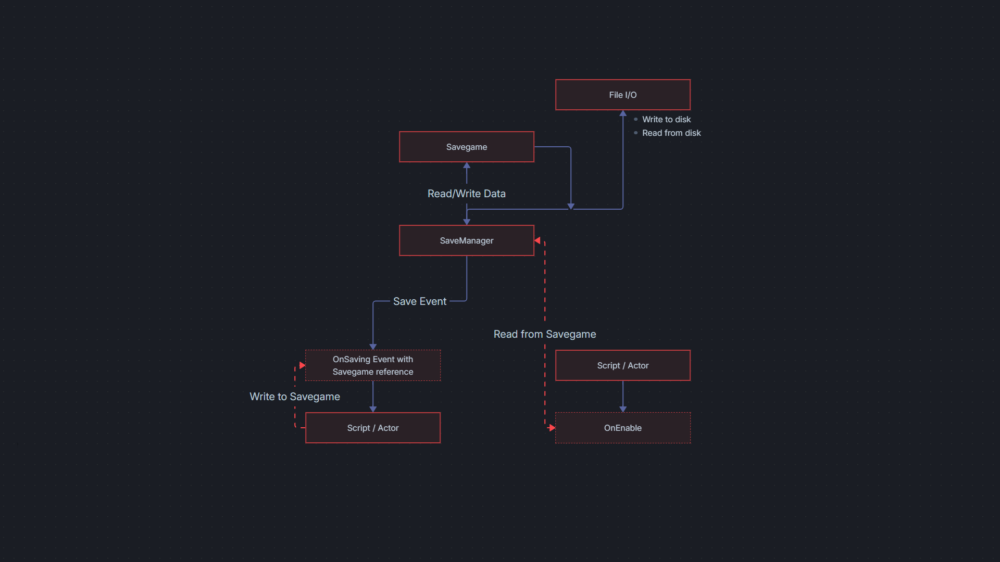

# FlaxSave - Component based save system for the Flax Engine


#### Table of Content
1. [What is FlaxSave?](#what-is-flaxsave)
2. [How it works](#how-it-works)
3. [Features](#features)
4. [Examples](#examples)
5. [Documentation](#documentation)
6. [Planned Features](#planned-features)
7. [Installation](#installation)
8. [Known Issues](#known-issues)


## What is FlaxSave?
FlaxSave is a modular, event-driven save system for the Flax Engine. It provides persistent game states across scenes and sessions, covering actors, scripts and asset states without forcing a fixed interface or inheritance hierarchy.

The system is designed to be simple to integrate for projects ranging from quick and small scale to full blown productions.


## How it works
Instead of requiring actors and scripts to implement a specifc interface or base class, saving and loading is handled thru events and simple api, available in a central `SaveManager`. Game code can use to these events and apis to handle serialization in a way that fits the project.

While not mandatory, the intended workflow is that each persistable actor owns a dedicated script subscribed to the save event, that reads serialized data on initilization. These scripts are responsible for capturing and restoring the actors state in a self contained fashion.

This design allows for incremental integration into a project, without the need to refactor existing code. It allows save and load logic to remain fully project specific, without framework level restrictions.



## Features
- Persistent save data across scenes and sessions
- Event-driven, decoupled save and load logic
- Component-based object state saving
- Asynchronous save operations to avoid frame stalls
- JSON-based save files with configurable file extension
- Unlimited save slots (storage limited only by disk space)
- Savegame versioning via metadata
- Auto-save support with configurable intervals
- Persistent storage using the platform's application data folder
- Separate handling for Editor and in-game saves


## Examples
The following examples are included and reusable:
- **SavableTransform** A script that saves and loads the transform of an actor
- **SaveHotbar** A script that dispatches saving and loading via button press
- **SavableAssets** Various JSON-Asset classes that save and load engine settings
- **User Interface** Scripts for a dynamic savegame list for in-game use


## Documentation
The [documentation](https://www.google.com/) contains everything from quickstart guides to API documentation, with focus on practical usage rather than theory.


## Installation
#### Requirements
- FlaxEngine `v. 1.11` or above
#### The easy way: 
- In the Flax Editor, go to `Tools > Plugins > Clone Project`
- Paste this repo link `https://github.com/Myterian/FlaxSave.git` into the `Git Path`
- Click `Clone`
- Restart the Editor
- Done


#### Manual installation:
- Close the Editor
- Clone this repo into `<your-game-project-folder>\Plugins\FlaxSave\`
- Add a reference to FlaxEvent to your game, by modifying the `<your-game>.flaxproj` file
```
...
"References": [
    {
        "Name": "$(EnginePath)/Flax.flaxproj"
    },
    {
        "Name": "$(ProjectPath)/Plugins/FlaxSave/FlaxSave.flaxproj"
    }
]
...
```
- Restart the Editor
- Done


## Known Issues
- None
